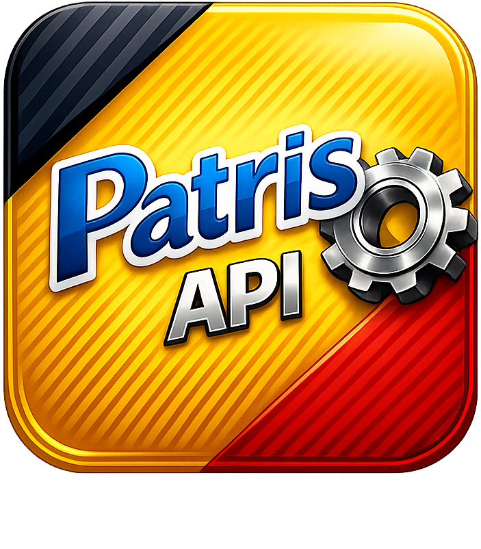

#  Patris Export

A fast and performant application for reading, parsing, and converting Paradox/BDE database files (`*.db`) from Patris81 software.

[](https://github.com/atomicdeploy/patris-export/actions/workflows/build.yml)
[](https://golang.org)
[](LICENSE)

## ✨ Features

- 🔄 **Convert Paradox DB files** to JSON or CSV formats
- 🎯 **Persian/Farsi encoding support** - Automatically converts Patris81 proprietary encoding
- 👀 **File watching** - Automatically converts files when they change
- 🌐 **REST API** - HTTP JSON API for accessing database records
- 🔌 **WebSocket support** - Real-time updates when database changes
- 🔔 **Smart notifications** - Audio alerts, title flashing, and favicon changes on data updates
- 🔒 **Write-lock prevention** - Copies files to temp location to avoid BDE conflicts
- 🔐 **File integrity** - CRC32 checksum calculation and verification
- 🔍 **Process monitoring** - Detect running Patris81 instances and file locks
- ⚠️ **Conflict detection** - Warns about potential conflicts in direct access mode
- 🎨 **Beautiful CLI** - Colorful terminal output with emojis
- 🏢 **Company.inf support** - Parse company information files
- ⚡ **Fast and lightweight** - Written in Go with native performance
- 🐧🪟 **Cross-platform** - Supports both Linux and Windows

## 🚀 Installation

### From Release

Download the latest release for your platform from the [Releases page](https://github.com/atomicdeploy/patris-export/releases).

**Windows users:** The Windows release includes the required pxlib.dll file. Make sure to keep it in the same directory as the executable.

### From Source

Requirements:
- Go 1.23 or later
- pxlib development library
  - **Linux:** `sudo apt-get install pxlib-dev pxlib1`
  - **Windows:** See [docs/WINDOWS_BUILD.md](docs/WINDOWS_BUILD.md) for building pxlib

**On Ubuntu/Debian:**
```bash
sudo apt-get install pxlib-dev pxlib1
go install github.com/atomicdeploy/patris-export/cmd/patris-export@latest
```

**Build manually:**
```bash
git clone https://github.com/atomicdeploy/patris-export.git
cd patris-export
make build
```

## 📖 Usage

### Convert Database to JSON

```bash
patris-export convert kala.db -f json -o output/
```

### Convert Database to CSV

```bash
patris-export convert kala.db -f csv -o output/
```

### Output to STDOUT

You can output directly to stdout by using `-` as the output destination, which allows for piping and redirection:

```bash
# Output JSON to stdout
patris-export convert kala.db -f json -o -

# Pipe to jq for filtering
patris-export convert kala.db -f json -o - | jq '.["12345"]'

# Redirect to file
patris-export convert kala.db -f csv -o - > output.csv
```

Note: Watch mode (`-w`) cannot be used with stdout output.

### Watch File for Changes

```bash
patris-export convert kala.db -f json -w
```

This will automatically re-convert the file whenever it changes. The convert command uses a 1-second debounce by default, meaning that rapid successive changes to the file will only trigger one conversion after the changes have settled.

You can customize the debounce duration with the `--debounce` flag:

```bash
# No debounce (immediate conversion on every change)
patris-export convert kala.db -f json -w --debounce 0s

# 500ms debounce
patris-export convert kala.db -f json -w --debounce 500ms

# 5 second debounce
patris-export convert kala.db -f json -w --debounce 5s
```

### Show Database Information

```bash
patris-export info kala.db
```

### Parse Company Information

```bash
patris-export company company.inf
```

### Start REST API Server

```bash
patris-export serve kala.db -a :8080
```

Terminal WebSocket inspection with WebSocat is documented in [docs/examples/websocat.md](docs/examples/websocat.md).
Embedding, loadable-library builds, and local IPC are documented in [docs/EMBEDDING.md](docs/EMBEDDING.md).

Experimental RTL logical text conversion is available as an opt-in backend flag
and web display setting. See [docs/RTL_CONVERSION.md](docs/RTL_CONVERSION.md).

### One-shot Native Viewer

Open a local snapshot viewer directly from a database file:

```bash
patris-export kala.db
patris-export --db kala.db
patris-export view kala.db
```

The command safely reads through a temporary copy by default, generates a self-contained HTML snapshot, and opens it in a native app-style window where the platform provides one. On Windows it prefers Microsoft Edge/WebView2 runtime app mode; on Linux it prefers browser app mode and falls back to `xdg-open`.

Generate the snapshot without opening a window:

```bash
patris-export view kala.db --no-open --html-output output/kala-viewer.html
```

Then access:
- Web interface: http://localhost:8080
- API records: http://localhost:8080/api/records
- API info: http://localhost:8080/api/info
- WebSocket: ws://localhost:8080/ws

The server watches the database file by default and broadcasts updates immediately (no debounce) to all connected WebSocket clients when changes are detected.

#### 🔔 Notification Features

The web viewer includes smart notification features. Visual alerts are always shown for data changes, while audio alerts can be enabled in the Settings panel:

- **🔊 Audio Notifications** - Play a subtle sound when data changes
- **📋 Title Flashing** - Page title briefly flashes with change count (e.g., "🔔 3 records updated")
- **🔴 Favicon Alert** - Favicon changes to a red dot indicator during updates
- **💾 Settings Persistence** - All notification preferences are saved to browser localStorage

These features help you stay aware of database changes even when the browser tab is in the background.

You can customize the debounce duration for the server with the `--debounce` flag:

```bash
# 500ms debounce for server updates
patris-export serve kala.db -a :8080 --debounce 500ms

# 1 second debounce
patris-export serve kala.db -a :8080 --debounce 1s
```

## 🎯 Using Character Mapping

Patris Export embeds the default Patris81 legacy encoding map, so Persian/Farsi text conversion works without passing an external file. Use `-c/--charmap` only when you want to override the built-in map for custom conversion or debugging.

```bash
# Uses the embedded Patris81 character map
patris-export convert kala.db -f json

# Optional override for custom/debug mapping
patris-export convert kala.db -c custom-farsi-chars.txt -f json
```

## 🔌 WebSocket Example

Connect to the WebSocket endpoint to receive real-time updates:

```javascript
const ws = new WebSocket('ws://localhost:8080/ws');

ws.onmessage = (event) => {
    const data = JSON.parse(event.data);
    console.log('Received update:', data);
    console.log('Record count:', data.count);
    console.log('Records:', data.records);
};
```

The server will automatically broadcast updates to all connected clients immediately when the database file changes (no debounce delay for real-time responsiveness).

## 🏗️ Architecture

```
patris-export/
├── cmd/
│   └── patris-export/     # Main CLI application
├── pkg/
│   ├── paradox/           # Paradox DB file reader (using pxlib)
│   ├── converter/         # Patris encoding converter & exporter
│   ├── watcher/           # File watcher with hash-based change detection
│   └── server/            # REST API & WebSocket server
├── testdata/              # Sample database files
└── docs/                  # Documentation
```

## 🛠️ Development

### Build Commands

```bash
make build          # Build for current platform
make build-linux    # Build for Linux
make build-windows  # Build for Windows (see docs/WINDOWS_BUILD.md)
make build-all      # Build for all platforms
make test          # Run tests
make clean         # Clean build artifacts
make install       # Install to GOPATH/bin
```

### Running Tests

```bash
go test -v ./...
```

## 📋 Command Reference

### Global Flags

- `-c, --charmap` - Optional path to a custom character mapping file. If omitted, the embedded Patris81 mapping is used.
- `-o, --output` - Output directory for converted files, or `-` for stdout (default: current directory)
- `-v, --verbose` - Enable verbose logging
- `-r, --rtl` - Opt in to experimental RTL logical text conversion for mixed Persian/Latin output

### Commands

#### `convert [database-file-or-url]`
Convert a local or HTTP/HTTPS Paradox database file to JSON or CSV. Remote sources are downloaded to a temporary file before reading.

**Flags:**
- `-f, --format` - Output format: json or csv (default: json)
- `-w, --watch` - Watch a local file or poll a URL for changes and auto-convert
- `-d, --debounce` - Debounce duration for local watch mode; polling interval for URLs (default: 1s, examples: 500ms, 5s, 5m)

**URL examples:**
```bash
patris-export convert https://example.com/data/kala.db -o ./exports
patris-export convert https://example.com/data/kala.db --watch --debounce 5m
```

#### `info [database-file]`
Display information about a Paradox database file (fields, record count, etc.)

#### `company [company.inf]`
Parse and display company information from company.inf file.

#### `serve [database-file-or-url]`
Start the REST API and WebSocket server.

**Flags:**
- `-a, --addr` - Server address (default: :8080)
- `-w, --watch` - Watch local files or poll URL sources and broadcast updates (default: true)
- `-d, --debounce` - Debounce duration for local files; polling interval for URLs (default: 0s for local files, 5m for URLs)

**URL example:**
```bash
patris-export serve https://example.com/data/kala.db --host 127.0.0.1 --port 8080 --debounce 5m
```

#### `update`
Update the installed executable from the latest successful GitHub Actions build artifact.

**Flags:**
- `-b, --branch` - Branch to download from (default: main)

**Examples:**
```bash
# Update from main
patris-export update

# Update from another branch
patris-export update --branch develop
```

`GITHUB_TOKEN` is optional for public repositories, but recommended for higher API rate limits. Private repositories require a token that can read the repository and its Actions artifacts, such as a classic token with `repo` access.

Repository lookup defaults to `atomicdeploy/patris-export`. Override it with `PATRIS_REPO_OWNER` and `PATRIS_REPO_NAME` when testing forks or custom deployments.

## 🔧 API Reference

### REST Endpoints

#### `GET /`
Web interface with API documentation.

#### `GET /api/records`
Returns all database records in JSON format.

**Response:**
```json
{
  "success": true,
  "count": 100,
  "records": [...]
}
```

#### `GET /api/info`
Returns database schema information.

**Response:**
```json
{
  "success": true,
  "file": "kala.db",
  "num_records": 100,
  "num_fields": 10,
  "fields": [...]
}
```

### WebSocket

#### `ws://localhost:8080/ws`
Connect to receive real-time database updates.

**Message format:**
```json
{
  "type": "update",
  "timestamp": "2025-12-13T23:45:19Z",
  "count": 100,
  "records": [...]
}
```

Clients can request an immediate backend reload without waiting for the next file watcher event or URL polling interval:

```json
{"type":"refresh"}
```

## 🗺️ TODO

### Planned Features
- [ ] Support for additional database formats
- [ ] Batch processing of multiple files
- [ ] Database diff functionality
- [ ] Custom field filtering and transformation
- [ ] GraphQL API support
- [ ] Docker containerization
- [ ] Performance benchmarks
- [ ] Comprehensive test coverage
- [ ] Advanced WebSocket features (subscribe to specific records, filtering)
- [ ] Configuration file support (YAML/JSON)
- [ ] Compression support for large exports
- [ ] Incremental export (only changed records)
- [ ] SQL export format support
- [ ] Data validation and integrity checks
- [ ] Import capabilities (reverse conversion)

### Known Limitations
- Currently optimized for Patris81 database format
- Windows cross-compilation requires mingw-w64
- Large database files may require significant memory

## 📄 License

MIT License - see LICENSE file for details.

## 🙏 Acknowledgments

- [pxlib](https://pxlib.sourceforge.net/) - Paradox database library
- Original PHP implementation and character mappings
- Patris81 software and its database format

## 📞 Support

For issues, questions, or contributions, please visit the [GitHub repository](https://github.com/atomicdeploy/patris-export).
