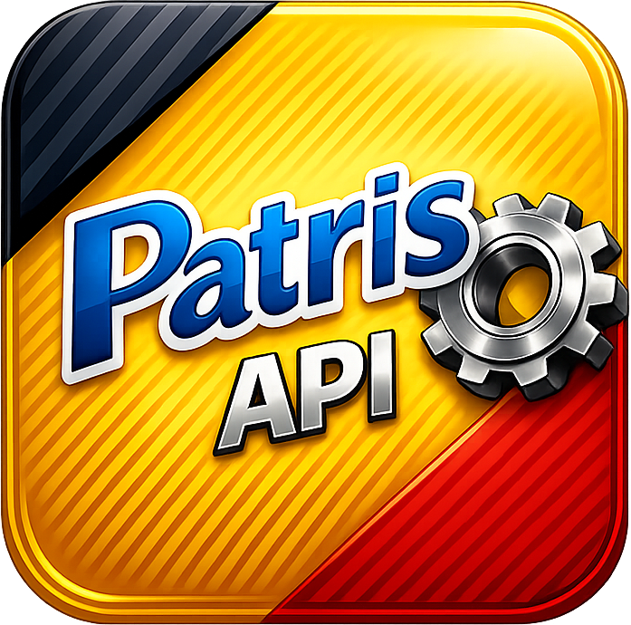

#  Patris Export

Patris Export reads Paradox/BDE database files, exposes them as a local web
service, and publishes useful views to files, spreadsheets, SQL databases, or
other applications. It works as a standalone utility and as a replaceable
module in a larger catalog/integration system.

[](https://github.com/atomicdeploy/patris-export/actions/workflows/build.yml)
[](https://go.dev)
[](LICENSE)

## What it does

- reads local or HTTP(S) Paradox `.db` files through pxlib;
- returns ordered raw rows for arbitrary Paradox schemas;
- projects `kala.db` into separate products and categories;
- converts Patris81 text to Unicode Persian with an embedded character map;
- exports JSON, CSV, XLSX, SQLite, and MySQL/MariaDB;
- provides a Web UI, REST API, WebSocket, TUI, local IPC, and one-shot viewer;
- watches sources and sends full/change updates to HTTP or local commands;
- supports optional pricing enrichment without coupling the core to
  Digitalogic or WordPress;
- preserves missing versus explicit-null values and tolerates extension fields
  at extensible canonical boundaries;
- offers dynamic, CGO-shared, and CGO-static pxlib build modes;
- packages source-built releases, a Windows installer, checksums, manifests,
  changelog, and offline API documentation.

## Start in five minutes

Inspect a table:

```powershell
patris-export info C:\Patris\data4\kala.db
```

Open an app-style snapshot:

```powershell
patris-export C:\Patris\data4\kala.db
```

Start the local viewer/API:

```powershell
patris-export serve C:\Patris\data4\kala.db --addr 127.0.0.1:8080
```

Then open <http://127.0.0.1:8080/viewer>.

Export a Persian formula workbook:

```powershell
patris-export convert C:\Patris\data4\kala.db --format xlsx `
  --output .\exports `
  --xlsx-language fa `
  --xlsx-mode formula `
  --xlsx-zebra=true
```

See [Getting started](docs/GETTING-STARTED.md) for a safe first-run workflow.

## Choose the correct data surface

| Surface | Purpose |
| --- | --- |
| `GET /api/records` | Ordered raw rows for any readable Paradox schema |
| `GET /api/products` | Transformed `kala.db` sellable products |
| `GET /api/categories` | Transformed `kala.db` category hierarchy |
| `GET /api/product-sync` | Atomic replication compatibility envelope with products, categories, exclusions, quarantine, tombstones, and identities |
| `GET /api/info` | Physical table fields and record metadata |
| `GET /api/source/file` | Active source-file bytes with ETag/range support |
| `/ws` | Built-in viewer and external live-event stream |

`/api/product-sync` is not a second product-list route. It remains for stateful
receivers that need an atomic replication event. New list/search/export clients
should normally use `/api/products` and `/api/categories`; unfamiliar tables
should use `/api/records`.

Read [Architecture](docs/ARCHITECTURE.md) for the route decision and extension
policy. Exact HTTP and WebSocket shapes are in the
[generated API reference](docs/api/README.md).

## Installation

Download a source-built package from the
[Releases page](https://github.com/atomicdeploy/patris-export/releases).

- **Windows:** use the assisted installer for shortcuts, safe upgrades, and
  uninstall, or the portable ZIP for embedding. Keep `libpxlib.dll` beside the
  executable for the default dynamic build.
- **Linux:** extract the tarball and use `run-patris-export.sh` so the bundled
  pxlib runtime is discoverable.

Every release includes checksums, a build manifest, changelog, source links,
and installation notes. See [Binary installation](docs/INSTALL-BINARIES.md)
and [Windows installer](docs/WINDOWS_INSTALLER.md).

### Build from source

Requirements:

- Go 1.25 or later;
- a supported pxlib backend;
- Node.js when rebuilding the Web UI/API documentation;
- platform C tooling for CGO/Windows resources when that build mode requires
  it.

```bash
git clone https://github.com/atomicdeploy/patris-export.git
cd patris-export
./build.sh --target current
```

Windows:

```cmd
build.cmd
```

Common variants:

```bash
./build.sh --target linux
./build.sh --target windows-cross
./build.sh --target all --test
./build.sh --target linux --pxlib-backend dynamic
./build.sh --target linux --pxlib-backend cgo
./build.sh --target linux --pxlib-backend cgo-static
```

See [Native pxlib backends](docs/NATIVE-PXLIB-BACKENDS.md),
[Windows build](docs/WINDOWS_BUILD.md), and
[pxlib FFI](docs/PXLIB-FFI.md).

## CLI overview

| Command | Purpose |
| --- | --- |
| `patris-export <database.db>` | Open a one-shot viewer |
| `convert <source>` | Write JSON/CSV/XLSX/SQLite/MySQL once or in watch mode |
| `info <database.db>` | Inspect Paradox fields and record count |
| `company <company.inf>` | Parse an explicitly supplied company file |
| `view [source]` | Generate/open a self-contained snapshot |
| `serve [source]` | Run Web UI, REST, WebSocket, and/or IPC |
| `stub` / `edge` | Upload one watched source to a central instance |
| `ipc <method> [params]` | Call the local JSON-lines endpoint |
| `tui [database.db]` | Open the terminal operations dashboard |
| `verify <snapshot.json\|->` | Validate a product-sync compatibility snapshot |
| `update` | Replace the executable from a verified artifact/manifest |
| `license ...` | Inspect/manage optional build-time licensing |

The complete flag reference is [CLI reference](docs/CLI-REFERENCE.md). In
particular, `-d` is `--direct-access`; debounce is the long
command-specific `--debounce` flag.

## Conversion examples

Raw source rows, with no significant transformation:

```bash
patris-export --raw convert other.db --format json --output -
```

JSON and CSV:

```bash
patris-export convert kala.db --format json --output ./exports
patris-export convert kala.db --format csv --output ./exports
```

SQLite:

```bash
patris-export convert kala.db --format sqlite \
  --sqlite-path ./exports/catalog.sqlite \
  --table products \
  --batch-size 250
```

MySQL/MariaDB:

```bash
export PATRIS_EXPORT_MYSQL_DSN='user:password@tcp(db.example:3306)/catalog?parseTime=true'
patris-export convert kala.db --format mysql --table products
unset PATRIS_EXPORT_MYSQL_DSN
```

`upsert_only` is the safe SQL default. Review
[Configuration: SQL destinations](docs/CONFIGURATION.md#sql-destinations)
before using soft or hard missing-row reconciliation.

Watch and send updates:

```bash
patris-export convert kala.db --format json --watch \
  --send-url https://receiver.example/catalog/events \
  --send-mode changes \
  --send-retry-attempts 3 \
  --send-retry-backoff 2s
```

See [Remote API examples](docs/REMOTE-API-EXAMPLES.md) for REST, JSON-RPC,
WordPress AJAX, and gRPC-gateway adapters.

## Configuration

Patris Export supports layered JSON, YAML, and TOML files:

```bash
patris-export \
  --config ./config/base.yaml \
  --config ./config/office.yaml \
  serve
```

Effective precedence is defaults, config files in order, environment, then
explicit CLI flags.

Useful controls:

```yaml
database:
  path: C:\Patris\data4\kala.db
  direct_access: false
  raw: false

canonical:
  enabled: true
  profiles:
    kala.db:
      type: kala
  hashes:
    enabled: true
    expose: false

ui:
  language: fa
  rtl_text_direction: true
```

Record hashes are optional change identities, not credentials or signatures.
See [Configuration](docs/CONFIGURATION.md),
[Record hashes](docs/RECORD-HASHES.md), and
[Datasets, mappings, and i18n](docs/DATASETS-MAPPINGS-I18N.md).

## Web UI, TUI, and embedding

The Web UI provides live search/table views, language/RTL settings, exports,
event details, source/process status, and bounded SQL operator controls.

The TUI provides source, fields, config, charmap, process/file-lock, tools, and
version tabs:

```bash
patris-export tui kala.db
```

See [TUI guide](docs/TUI-GUIDE.md).

Electron, Tauri, WebView2, native applications, and services can use HTTP,
WebSocket, IPC, the embeddable Go router, or the C-compatible library build.
See [Ecosystem and integrations](docs/ECOSYSTEM-AND-INTEGRATIONS.md) and
[Embedding](docs/EMBEDDING.md).

## Documentation

[Documentation hub](docs/README.md):

- [Getting started](docs/GETTING-STARTED.md)
- [CLI reference](docs/CLI-REFERENCE.md)
- [Configuration](docs/CONFIGURATION.md)
- [Architecture](docs/ARCHITECTURE.md)
- [Ecosystem and integrations](docs/ECOSYSTEM-AND-INTEGRATIONS.md)
- [Datasets, mappings, and i18n](docs/DATASETS-MAPPINGS-I18N.md)
- [Record hashes](docs/RECORD-HASHES.md)
- [Glossary](docs/GLOSSARY.md)
- [API documentation build](docs/api/README.md)

Build and validate static/offline API documentation:

```bash
npm --prefix docs/api ci
npm --prefix docs/api run lint
npm --prefix docs/api run parity
npm --prefix docs/api test
npm --prefix docs/api run build
npm --prefix docs/api run check:determinism
```

The public static reference is suitable for a future GitHub Pages deployment.
The complete internal reference contains operator/private routes and must stay
inside an authorized boundary.

## Current scope and roadmap

The current server owns one active `.db` per process. Automatic `company.inf`
discovery, full `dataN` multi-database loading/watching, filtered-subset server
export, TSV/BSON/MessagePack/Protocol Buffers, SQLite API downloads, unified
OS/API-key ACL, and Windows-only Patris81 UI automation are roadmap work—not
features claimed by this README.

Track implementation through [GitHub issues](https://github.com/atomicdeploy/patris-export/issues).
The repository `TODO.md` is a secondary engineering checklist; it must not
override current code, checked API contracts, or issue status.

## Development

```bash
make build
make test
go test ./...
```

Windows native tests:

```powershell
powershell -NoProfile -ExecutionPolicy Bypass `
  -File .\scripts\windows\Invoke-CGO.ps1 `
  go test ./pkg/server
```

API documentation:

```bash
make docs-install
make docs-verify
make docs-package
```

## License and support

Patris Export is licensed under the [MIT License](LICENSE). See
[SECURITY.md](SECURITY.md) for security reporting and
[GitHub Issues](https://github.com/atomicdeploy/patris-export/issues) for
reproducible bugs and feature tracking.

Patris81 is a product of [Faradadeh](http://www.faradadeh.com). This project is
an independent export/integration utility.
