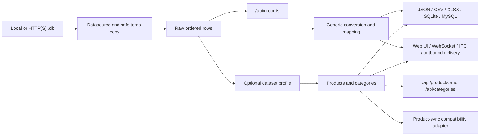

# Architecture

Patris Export is a Paradox datasource and export service with optional
dataset-specific modules. The core must remain useful without Digitalogic,
WordPress, `kala.db`, or any one receiver.

## Design principles

1. **General source first.** Any readable Paradox table can be inspected as an
   ordered row collection.
2. **Profiles add meaning.** `kala.db` product/category rules are an optional
   [projection](GLOSSARY.md#projection), not the universal Paradox schema.
3. **Sparse data stays sparse.** An unseen field is omitted. An explicit source
   `null` remains distinguishable from omission where the typed projection
   supports it.
4. **Consumers choose their boundary.** A viewer, SQL sink, spreadsheet,
   module, and replication receiver do not need the same envelope.
5. **Extensions are tolerated.** Decoders preserve unknown JSON members at
   extensible canonical boundaries so a newer peer can add data without an
   older peer silently destroying it during decode/re-encode. Known-field
   invariants still apply.
6. **Integrations are optional adapters.** Remote pricing, WordPress, Excel,
   edge upload, IPC, and outbound delivery use the core pipeline but do not
   own it.
7. **Unsafe side effects are explicit.** Direct database writes,
   reconciliation, uploads, and operator actions have their own bounds and
   diagnostics.

## Process overview

The datasource abstraction supports local files, HTTP(S) downloads, and test
JSON sources. pxlib is used to read native Paradox tables. A temporary copy is
the default when the operation can safely create one; `--direct-access` opts
out.

## Pipeline stages

### 1. Source acquisition

`pkg/datasource` selects a source implementation. `pkg/filecopy` manages local
copies, downloads, temp-directory policy, and atomic replacement. Native
Paradox access lives under `pkg/paradox` and can be built with dynamic,
CGO-shared, or CGO-static pxlib backends.

The current process owns one active database source. Source refresh replaces
that active source for API/UI/WebSocket consumers.

### 2. Raw rows

`GetRawRecords` exposes field/value maps in source order. Raw mode removes
internal `Sort*` fields but deliberately avoids:

- character conversion;
- `ANBAR1..n` compaction;
- `Code` keying;
- configured renames/defaults/value maps;
- RTL conversion;
- pricing or product/category classification.

That behavior makes `/api/records` safe for unfamiliar schemas and prevents
missing or duplicate `Code` values from being collapsed.

### 3. Generic transform

For non-raw sources without a semantic profile, `pkg/converter` applies the
Patris character conversion and established record shaping, then
`pkg/recordmap` applies configured field/value/default/include/drop/numeric
rules.

This older transformed path is `Code`-keyed and therefore is not the raw
boundary. New schema exploration should start at `/api/records`.

### 4. Dataset profile

`pkg/canonical` currently supplies the `kala` profile. It:

- distinguishes structural category rows, products, reserved non-merchandise
  rows, duplicate codes, and ambiguous rows;
- projects human-meaningful machine keys;
- preserves categories separately from sellable products;
- optionally enriches products through `pkg/pricingcatalog`;
- omits integration-only shipping/pricing fields when no active integration
  supplied them;
- records exclusions and quarantine rather than turning ambiguous rows into
  products.

The profile is selected by source base name in `canonical.profiles`. Other
Paradox tables still work through the raw endpoint even when no profile exists.

### 5. Sinks and transports

`pkg/recordsink` writes JSON, CSV, XLSX, SQLite, and MySQL/MariaDB.
`pkg/updateout` sends HTTP or command updates. `pkg/server` provides the Web
UI, REST, WebSocket, source/update downloads, SQL operator operations, and edge
ingestion. `pkg/embedded` and `pkg/ipc` expose the same server functionality to
native hosts.

## Choosing a data route

| Route | Shape and purpose | Use it when |
| --- | --- | --- |
| `GET /api/records` | Ordered array of raw source rows | Inspecting any Paradox schema, retaining row order/cardinality, or writing your own transform |
| `GET /api/products` | `product_code`-keyed `kala` product collection; CSV/XLSX row forms also available | Listing/searching/exporting products without replication metadata |
| `GET /api/categories` | `category_code`-keyed `kala` hierarchy | Building navigation or resolving a product's category |
| `GET /api/product-sync` | Products, categories, exclusions, quarantine, tombstones, source/event identities in one event | Applying an atomic full/change event to a stateful replica |
| `GET /api/info` | Physical table metadata and fields | Discovering a source before choosing a mapping |
| `GET /api/source/file` | Original active source bytes with ETag and byte ranges | Copying the source file itself |

`/api/products`, `/api/categories`, and `/api/product-sync` return `404` when
the active dataset has no enabled semantic profile. That does not make the
database unsupported; `/api/records` and `/api/info` remain the generalized
surfaces.

## Why `product-sync` still exists

`/api/product-sync` would be duplication if it were only another product-list
route. It is retained because it supplies a different operation: an atomic
[replication adapter](GLOSSARY.md#replication-adapter) for a receiver that
maintains state.

Its unique responsibilities are:

- one event containing both products and category hierarchy;
- excluded and quarantined code sets;
- deletion tombstones for change events;
- source revision and event identity used by existing idempotent receivers;
- verification of the known compatibility envelope.

Ordinary applications should use `/api/products` and `/api/categories`.
`/api/product-sync` is a compatibility surface, not the preferred model for
every integration and not evidence that Patris Export belongs to WordPress.
New receivers may parse only the fields they need, retain unknown extensions,
and report unsupported known semantics rather than rejecting a payload merely
because a peer carries additional members.

If all deployed replication consumers migrate to collection/change APIs with
equivalent atomic state semantics, the compatibility route can later be
deprecated through a measured migration. Removing it now would lose quarantine,
deletion, and acknowledgement behavior rather than merely removing duplicate
JSON.

## Flexible models and extensions

A [schema](GLOSSARY.md#schema) describes known field names and types; it is not
a demand that every implementation serialize every possible field. Patris
Export uses sparse output:

- not observed: omit the key;
- observed explicit null: encode `null`;
- observed value: encode that value.

Canonical JSON decoders preserve unknown extension members on extensible
objects during decode/re-encode. They continue to validate relationships among
known fields, such as paired shipping amount/currency values. This gives
consumers room to evolve while preventing a known value from becoming
internally contradictory.

Record hashes and the verifier are optional compatibility tools. Disabling
them leaves collection APIs and ordinary export available; see
[Record hashes](RECORD-HASHES.md).

## Byte ranges and generated resources

`/api/source/file` and `/api/update/executable` currently use `ServeContent`,
ETags, and `Accept-Ranges: bytes`. Generated JSON, CSV, and XLSX collections
are currently encoded per request and do not provide a persistent
revision-keyed byte-range cache.

A future cache must key artifacts by at least source revision, route,
format, locale, filter, mapping, and export options; publish temp files
atomically; validate `If-Range`; and bound storage/eviction. Until that work is
implemented, clients must not assume a `Range` header on generated collections
will resume a stable snapshot.

## Single-database and future directory mode

Today:

- one running process has one active `.db`;
- `company.inf` is parsed only when explicitly passed to the `company`
  command;
- edge upload replaces that one active source;
- watcher state follows that source.

Planned directory mode:

- accept an entire `dataN` directory;
- discover the paired same-directory `company.inf`;
- inventory and watch multiple `.db` tables;
- copy a Paradox table together with required companion files as one stable
  family;
- apply default-deny policy to sensitive/accounting/user/temp tables;
- expose per-dataset health and exceptions;
- keep raw discovery available even when no semantic mapping exists.

Directory mode is not implemented by simply pointing today's `serve` command
at a folder.

## Authentication boundary

Current authentication is route-specific:

- loopback/trusted-boundary viewer and diagnostics;
- optional edge bearer token;
- dedicated SQL operator session/CSRF flow;
- dedicated recent-sales bearer token;
- integration-specific outbound secret references.

This accurately reflects the implementation but is not the final architecture.
The planned direction is one principal abstraction (OS identity and/or API
key), one ACL for datasets/actions, loopback/local-network policy, and shared
audit decisions across viewing, download, upload, SQL, WebSocket, and IPC.
Until that exists, do not expose the listener directly to an untrusted network.

## Embedding

There are three supported integration depths:

1. HTTP/WebSocket client;
2. local JSON-lines IPC;
3. in-process Go engine/router or C-compatible shared-library build.

All reuse the server and record pipeline. JavaScript desktop applications can
call HTTP/IPC from Electron, Tauri, or WebView2; native hosts can mount the Go
router rather than opening another port. See [Embedding](EMBEDDING.md).

The experimental Windows automation work that observes and controls the
Patris81 desktop program is intentionally not part of the portable core yet.
It will require Windows build tags, read-only inspection first, explicit
process/window selection, and guarded input actions.

## Documentation architecture

The guides in `docs/*.md` are the narrative source. OpenAPI and AsyncAPI under
`docs/api` are the exact protocol sources. Static builds produce:

- a publishable public reference;
- a complete internal/operator reference;
- offline ZIPs with contracts and examples.

This separation allows GitHub Pages later without exposing private/operator
routes and allows AI tooling to consume YAML/JSON contracts instead of
scraping prose.
