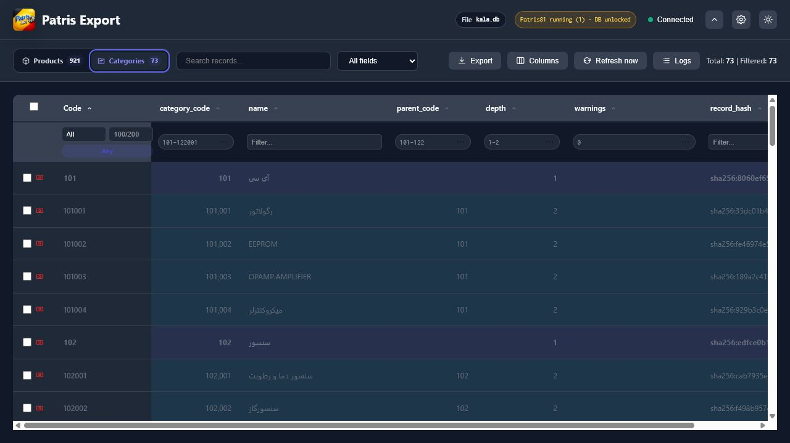
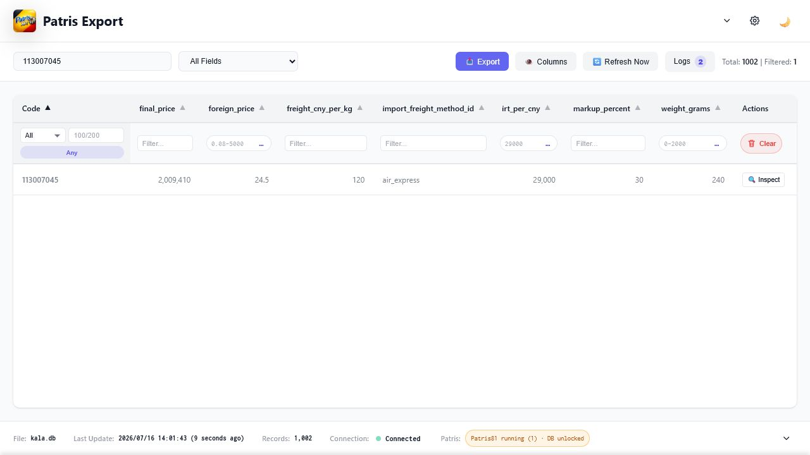
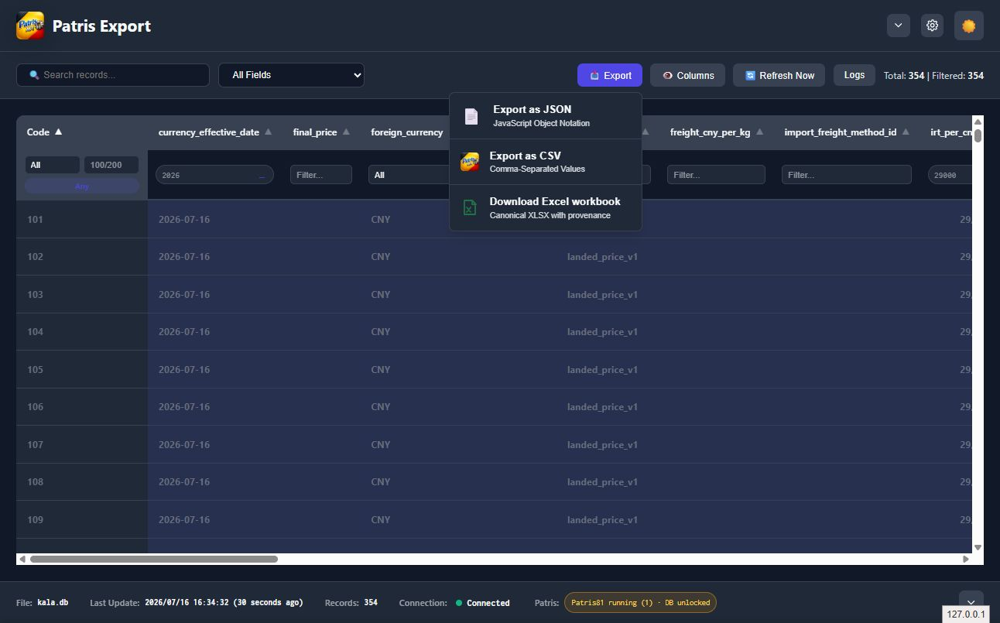

# Canonical `kala.db` Product and Pricing Contract

`kala.db` uses the built-in `kala_v1` dataset profile by default. The profile is
one stage inside `recordpipe.Build`; CLI exports, REST, WebSocket, webhooks,
XLSX, SQLite, and MySQL do not have separate transformation implementations.
Raw mode remains available for diagnostics.

## What the profile produces

The profile converts Patris text, preserves `Code` as a string, compacts
warehouses, and parses:

- the fourth numeric `Sharh1` slot as the foreign CNY unit price;
- grams and the remaining storage location from `Sharh2`;
- serial, unit, source sale/purchase prices, minimum stock, and selected
  warehouse stock;
- the product-specific shipping method and percentage markup;
- `landed_price_v1` with exact decimal arithmetic and one final half-up round.

The formula is:

```text
round_once((foreign_CNY + weight_g / 1000 * shipping_price_per_kg_CNY)
  * (1 + markup_percent / 100) * IRT_per_CNY)
```

The reference fixture `24.5 CNY + 240 g at 120 CNY/kg`, with `30%` markup and
`29,000 IRT/CNY`, is `2,009,410 IRT`.

Missing or conflicting price, weight, shipping method, shipping price, markup, or FX values
produce `final_price: null` and sorted machine-readable warnings. They never
become a destructive zero. Duplicate Codes are quarantined from the contract.

Raw `Sharh1`, `Sharh2`, `FOROSH`, `KHARYD`, `ALLANBAR`, and `ANBAR*` keys never
cross the `digitalogic.product-sync` boundary.

The wire boundary is sparse. A key that was never received or derived from a
real value is omitted from JSON and from the union of CSV/XLSX/SQL columns. An
explicit source `null` remains `null`. Pricing, formula, and shipping-method
keys are emitted only when static pricing is explicitly populated or a
Digitalogic endpoint is configured. The canonical output names are
`shipping_method_id` and `shipping_price_per_kg_cny`; legacy
`import_freight_method_id`, `freight_cny_per_kg`, and
`import_freight_methods` remain accepted as input aliases during migration.

## Offline/static pricing

Static mode is the standalone default. It works without WordPress or a network:

```json
{
  "canonical": {
    "enabled": true,
    "source_id": "patris-office",
    "profiles": {
      "kala.db": {"type": "kala_v1"}
    },
    "pricing": {
      "mode": "static",
      "static": {
        "revision": "office-rates-2026-07-16",
        "cny_to_irt": 29000,
        "currency_effective_date": "2026-07-16",
        "selected_warehouses": ["1", "2", "6"],
        "shipping_methods": [
          {"id": "air_express", "enabled": true, "price_per_kg_cny": 120}
        ],
        "assignments": {
          "113007045": {
            "shipping_method_id": "air_express",
            "profit_percent": 30
          }
        }
      }
    }
  }
}
```

## Digitalogic provider

Digitalogic mode reads, but does not mutate:

- `GET /wp-json/digitalogic/v1/integration/catalog` for FX, selected
  warehouses, and shipping methods;
- `POST /wp-json/digitalogic/v1/pricing-assignments/batch` for ordered,
  versioned assignment prefetches of at most 500 unique Codes;
- `GET /wp-json/digitalogic/v1/products/by-code/{code}/import-pricing` for the
  exact Code/SKU method and percentage markup when an older compatible provider
  does not expose the batch contract.

Canonical transform collects unique, non-quarantined Codes before its normal
per-record resolution, prefetches them in bounded request-order chunks, and
stores results in the existing bounded assignment LRU. A transform-scoped
result barrier also retains only that run's unique Codes and releases each
outcome as the row resolves, so a deliberately small `max_entries` cannot evict
current-run successes or diagnostics and recreate single-Code N+1 requests. It
does not create a second pricing client or transformation path. With the
default `batch_size: 500` and `max_entries: 2048`, a cold 1,002-Code catalog
performs exactly three batch POSTs plus one catalog GET, and performs zero
single-Code requests. Duplicate source Codes remain quarantined before
prefetch.

All chunks are staged before one atomic cache commit. Every chunk must carry
the same non-empty default-markup revision and the same schema, configured
state, source, type, and exact value; a mismatch discards every staged result.
Batch successes consume the minimal assignment projection and preserve the
exact decimal together with its `profit_percent_source`. Pricing decimals must
be quoted, canonical base-10 strings with at most 12 fractional digits;
unquoted numbers, exponent notation, redundant formatting, and over-scale
values fail closed. A `global_default` value must exactly match the shared
default snapshot.

Live outbound delivery to the current Digitalogic `/patris/push` receiver must
remain disabled; this branch does not enable or deploy it. That receiver must first
validate `digitalogic.product-sync` v1, merge update envelopes, honour
`deleted_codes`, and deduplicate `event_id`; its legacy full-replacement parser
would truncate a snapshot when given a delta. Keep delivery pointed at a
contract-aware staging receiver until that follow-up is merged and verified.

Credentials are read from named environment variables; secret values are not
stored in the Patris config:

```json
{
  "canonical": {
    "enabled": true,
    "profiles": {"kala.db": {"type": "kala_v1"}},
    "pricing": {
      "mode": "digitalogic",
      "digitalogic": {
        "base_url": "https://digitalogic.ir/wp-json/digitalogic/v1",
        "bearer_token_env": "DIGITALOGIC_PRICING_READ_TOKEN",
        "batch_assignment_path": "pricing-assignments/batch",
        "batch_size": 500,
        "fresh_for": "5m",
        "max_stale": "1h",
        "timeout": "15s",
        "max_entries": 2048,
        "max_concurrency": 8,
        "max_response_bytes": 2097152
      }
    }
  }
}
```

```powershell
$env:DIGITALOGIC_PRICING_READ_TOKEN = "..."
$env:PATRIS_EXPORT_PRICING_TIMEOUT = "15s"
$env:PATRIS_EXPORT_PRICING_BATCH_SIZE = "500"
patris-export serve C:\Patris\data4\kala.db
```

`PATRIS_EXPORT_PRICING_TIMEOUT` and `PATRIS_EXPORT_PRICING_BATCH_SIZE` override
the same normalized Digitalogic provider used by file configuration. Batch
size is capped at the remote contract maximum of 500. The 15-second timeout
default leaves headroom for a production 500-Code response without changing
the bounded request count or enabling single-Code fallback.

Only HTTPS is accepted remotely; plain HTTP is limited to loopback. Provider
paths must stay relative and on the configured origin, redirects are refused,
request/response bodies, assignment LRU, and diagnostic LRU are bounded,
configured credential environment variables must be populated, and cached
values are usable only inside `max_stale`. One `bearer_token_env` supplies the
same read token to the exact integration-catalog GET and assignment-batch POST;
the batch request otherwise reuses the existing HTTP client, timeout, TLS
rules, redirect policy, and response limit. Basic authentication and the
single-Code route remain compatibility options for replaceable older providers,
not the production least-privilege path.

HTTP 404, 405, or 501 from the batch route means a replaceable/older provider
does not support prefetch; Patris safely falls back to existing bounded
single-Code resolution and emits `pricing_assignment_batch_unsupported`.
Authentication failures, other HTTP/transport failures, oversized responses,
malformed schemas, changed result order/Codes, and inconsistent result counts
fail closed for that freshness window. Fresh fail-closed diagnostics are
honored by later prefetch runs, including when the per-Code diagnostic LRU is
smaller than a transform, so repeated transforms do not hammer a failing batch
route. Typed not-found and ambiguous-Code results are cached as authoritative
empty assignments, never retried through a different lookup path. Only a
per-Code server error explicitly marked `retryable: true` with a 5xx status may
fall back to the existing single-Code resolver. Cached stale assignments may
still be used only within `max_stale`, with explicit warnings; recent catalog
failures are also backed off for the freshness window so an outage cannot
recreate an N+1 catalog storm.
Static/standalone mode implements no prefetch capability and makes no remote
requests.

Production rollout depends on the pending Digitalogic least-privilege
credential work in issue #60. Once implemented and deployed, its dedicated
pricing-input bearer must authorize exactly the integration-catalog GET and
assignment-batch POST, not the legacy single-Code route or any write route. Do
not reuse Patris push or product-sync write secrets. Deploy the compatible
Digitalogic endpoint and that read credential before enabling production
prefetch, then reference the one credential through `bearer_token_env`.

Patris calculates only when the catalog is
`digitalogic.integration-catalog` major version 1, `currency.local` is `IRT`,
`currency.cny_to_irt` is valid, and `pricing.formula_id` plus its major
revision are compatible with `landed_price_v1`. Schema, currency, or formula
mismatches force null final prices and explicit compatibility warnings.

## Transport contract

Canonical JSON and JSON webhooks use `digitalogic.product-sync` version `1.1`.
Receivers that support major version 1 can continue accepting v1.0 product-only
envelopes; v1.1 adds exact category and exclusion projections without exposing
raw Patris fields.

`event_id` covers the validated `generated_at` value as well as the sorted
record hashes and tombstones. Identical content generated at a later time is a
new ordered occurrence, so a receiver can advance its watermark without
allowing an older changed event through afterward.

The server exposes this envelope at `GET /api/product-sync`. The viewer-facing
`GET /api/records` endpoint remains a Code-keyed collection of canonical
product rows; `GET /api/categories` returns the separately keyed category
hierarchy. Envelope metadata never appears as table rows. The viewer presents
both projections through one Products/Categories segmented control and reuses
the same table, filtering, column, context-menu, accessibility, and RTL logic.





Cross-project contract verification uses the entirely synthetic two-product
fixture at `testdata/digitalogic-product-sync-v1.synthetic.json`; production
exports and catalog values must never be committed as golden fixtures.

```json
{
  "schema": "digitalogic.product-sync",
  "schema_version": "1.1",
  "event": "digitalogic.product-sync",
  "event_type": "snapshot",
  "event_id": "sha256:...",
  "local_currency": "IRT",
  "formula_id": "landed_price_v1",
  "formula_revision": "1.0.0",
  "formula_version": "landed_price_v1",
  "source": {
    "id": "patris-office",
    "dataset": "kala.db",
    "revision": "sha256:..."
  },
  "generated_at": "2026-07-16T08:00:00Z",
  "products": [
    {
      "product_code": "113007045",
      "category_code": "113007",
      "foreign_currency": "CNY",
      "foreign_price": 24.5,
      "weight_grams": 240,
      "shipping_method_id": "air_express",
      "shipping_price_per_kg_cny": 120,
      "markup_percent": 30,
      "irt_per_cny": 29000,
      "final_price": 2009410,
      "formula_version": "landed_price_v1",
      "record_hash": "sha256:...",
      "warnings": []
    }
  ],
  "categories": [
    {
      "category_code": "113",
      "name": "Modules",
      "parent_code": "",
      "depth": 1,
      "warnings": [],
      "record_hash": "sha256:..."
    },
    {
      "category_code": "113007",
      "name": "Development modules",
      "parent_code": "113",
      "depth": 2,
      "warnings": [],
      "record_hash": "sha256:..."
    }
  ],
  "excluded_codes": ["999010"]
}
```

Product `category_code` is the longest supplied structural prefix (the
six-digit category is preferred over its three-digit parent). Partial extracts
without hierarchy rows keep the product and use an empty category code rather
than guessing. Category hashes cover code, name, parent, depth, and warnings;
category and exclusion changes participate in source revisions and event IDs.
Exact reserved accounting/service codes are excluded before classification,
and ambiguous numeric shapes, duplicates, or signal-bearing parent conflicts
are quarantined.

Record hashes and source revisions are stable over unchanged values. Event IDs
are deterministic for one occurrence and include its validated `generated_at`
wire value. Retries therefore reuse one envelope byte-for-byte, while a later
same-content occurrence receives a new ordered identity. Incremental events
contain complete changed products and deleted-Code tombstones such as
`{"product_code":"113007045","deleted":true}`.
Quarantined duplicate Codes are never tombstones: update diffs and SQL snapshot
reconciliation preserve the last known good downstream value until ambiguity
is resolved.

WebSocket messages retain their existing `added`/`modified`/`deleted` fields
and include the same versioned contract under `contract`. CSV and XLSX preserve
exact decimal lexemes. XLSX writes decimals that round-trip through Excel's
numeric representation as numeric cells and keeps longer precision as text
rather than silently changing it. Code is always text. Its frozen, filtered
Records sheet uses deterministic canonical columns, and its allowlisted
Metadata sheet carries the schema/formula/source revision/generated time and
normalized warnings without credentials, local paths, or raw Patris fields.
MySQL uses exact `DECIMAL` columns; SQLite declares
canonical decimal inputs as `DECIMAL_TEXT` so its numeric affinity cannot
silently coerce them through binary floating point. Final IRT prices remain
integers. Both SQL sinks add newly introduced columns on later exports.



For direct delivery to Digitalogic, use the existing HTTP update sink with
`require_contract: true`, the dedicated `/patris/product-sync` endpoint, and a
`product_sync_secret_env` reference. The secret value is read from that named
environment variable at request time and sent only in
`X-Digitalogic-Product-Sync-Secret`; it is not copied into persisted config or
delivery logs or inherited by an optional command sink. Remote secret-bearing
destinations require HTTPS. The sink preserves the canonical `X-Patris-*`
identity headers and uses contract `source.id` instead of the local database
path for `X-Patris-Source`. It parses the WordPress REST response, surfaces
apply state, and can retry the identical event when the receiver reports
partial/pending work. See
[`docs/examples/export-transform-send.md`](examples/export-transform-send.md)
for the complete configuration and retry policy.

The generic mapping pipeline remains available for datasets without a selected
profile. The canonical contract intentionally has fixed field names. To inspect
pxlib rows use `--raw`; to use generic mapping for `kala.db`, explicitly set
`PATRIS_EXPORT_CANONICAL=0`.
