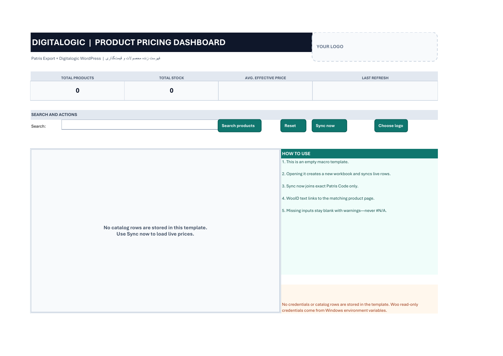

# Excel export

Patris Export writes `.xlsx` workbooks from the same transformed rows used by
JSON, CSV, SQL, REST, WebSocket, and update delivery. It does not add empty
pricing or shipping fields merely to complete a spreadsheet schema. Fields
that were never received stay absent; explicit null values produce blank cells.

## Language, direction, and labels

`xlsx_language = "auto"` follows `ui.language`. `en` and `fa` force English or
Persian human-readable column headings. Persian workbooks open right-to-left;
English workbooks remain left-to-right unless RTL is explicitly requested.
`column_labels` can still override individual headings. Machine keys in the
JSON, CSV, SQL, and API contracts are unchanged.

Structured `warehouse_stock` is expanded into deterministic numeric columns,
for example `Warehouse Stock 2` and `Warehouse Stock 10` (or their Persian
equivalents), rather than being serialized into one object cell.

## Price modes

- `precalculated` writes the canonical `final_price` value supplied by the
  shared transformation pipeline.
- `formula` writes a recalculating Excel formula in each final-price cell:

```text
shipping_irt = IF(shipping_price_per_kg_currency="CNY",
  weight_grams/1000*shipping_price_per_kg*irt_per_cny,
  weight_grams/1000*shipping_price_per_kg/10)
ROUND((foreign_price*irt_per_cny + shipping_irt)*(1+markup_percent/100),0)
```

The generated formula uses `COUNT` plus an exact currency-token guard and
returns a blank when any numeric input is missing/non-numeric or the shipping
currency is not uppercase `CNY` or `IRR`. CNY freight is converted through the
IRT/CNY rate; IRR freight is divided by 10. The workbook applies markup and
rounds once, at the final whole-IRT result. Excel is instructed to perform a
full recalculation on open and save. Formula and shipping/profit columns only
exist when the active integration produced the required amount/currency pair.

## CLI

```powershell
patris-export convert C:\Patris\data4\kala.db -f xlsx -o .\exports `
  --xlsx-language fa `
  --xlsx-mode formula `
  --xlsx-zebra=true
```

Use `--xlsx-zebra=false` for plain rows.

## Configuration and environment

```toml
[ui]
language = "fa"

[export]
xlsx_language = "auto"
xlsx_mode = "precalculated"
xlsx_zebra_rows = true
```

The environment equivalents are `PATRIS_EXPORT_XLSX_LANGUAGE`,
`PATRIS_EXPORT_XLSX_MODE`, and `PATRIS_EXPORT_XLSX_ZEBRA_ROWS`.

## HTTP and Web UI

```text
GET /api/records.xlsx?download=1&language=fa&mode=formula&zebra=1
GET /api/records?format=xlsx&language=en&mode=precalculated&zebra=0&rtl=0
```

The Web UI download action sends its active language and the configured export
mode/zebra preference to this route. Query values override the config for that
one response.

## Dynamic macro template

`docs/examples/Patris-Digitalogic-Price-Calculator.xltm` is the canonical
calculator template. It intentionally contains no product rows, cached REST
responses, live exchange/freight/profit values, or credentials. Opening the
`.xltm` creates a separate macro-enabled workbook instance, so a user's later
Save As operation does not overwrite the empty template.

Refresh-on-open and **Sync now** fetch:

```text
http://127.0.0.1:18080/api/product-sync
https://digitalogic.ir/wp-json/digitalogic/v1/google-sheets/catalog
```

The Patris source is the canonical `patris.product-sync` JSON envelope. The
Digitalogic source is the same protected, paginated catalog projection consumed
by the existing Google Apps Script. Excel and Google Sheets therefore stay
aligned by reading the same living contract; neither workbook writes through
the other.

The merge key is exact, case-sensitive Patris `product_code` to Digitalogic
`patris_code`. SKU and product name are never identity fallbacks. Matched rows
display `WooID <id>` as hyperlink text targeting the projected product
`permalink`. WooCommerce rows without a Patris record remain visible with their
`woo:<id>` sync key and warning state.

The Settings sheet displays three live summaries outside the table:

- `بهای یوآن` from `irt_per_cny`;
- `نرخ حمل CNY` from CNY-denominated `shipping_price_per_kg`;
- `درصد سود` from `markup_percent`.

One consistent value is shown numerically; multiple live values display a
`Mixed (n)` warning instead of silently choosing one. The product calculation
uses each row's canonical inputs, not these display summaries. Missing, null, or
invalid inputs stay blank and their source warning remains in **Sync Status**.
The Excel formula uses `COUNT` and an exact currency guard, so it does not emit
`#N/A`.

The Digitalogic route remains protected. The template reads the names
`DIGITALOGIC_CONSUMER_KEY` and `DIGITALOGIC_CONSUMER_SECRET` from Settings, then
loads their values from the Excel process environment. It never stores those
values in cells or VBA. The Authorization header is permitted only for
`https://digitalogic.ir/`, and the WooCommerce key must have Read permission
only.

Refreshes preserve the optional manual price override, review status, and notes
only while the exact, case-sensitive Code still exists; source-derived values
always refresh. The displayed effective price uses a numeric manual override and
otherwise falls back to the canonical final price.

Enable macros only after reviewing:

- `docs/examples/vba/JsonValue.cls`;
- `docs/examples/vba/JsonRuntime.bas`;
- `docs/examples/vba/PatrisDashboard.bas`;
- `docs/examples/vba/ThisWorkbook.cls`.

The Windows builder removes local absolute paths, neutralizes Office author
metadata to `AtomicDeploy`, removes volatile core-property timestamps,
normalizes ZIP timestamps, and rejects external links/connections or private
workstation metadata before publishing the template and checksum.

The package is reopened by the Go/Excelize regression suite for macro-package
and metadata checks. Its VBA is also imported, compiled, calculated, and
integration-tested with native Excel 16. LibreOffice compatibility is not
claimed without a LibreOffice runtime in the validation environment.


