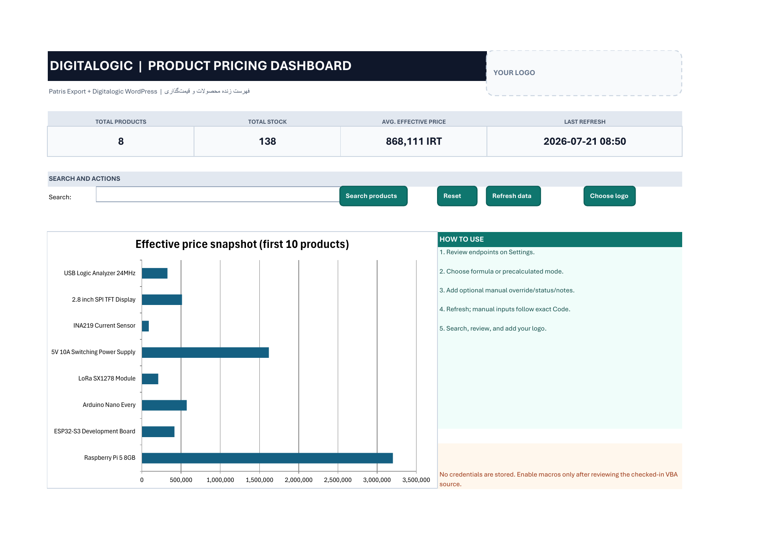

# Excel export

Patris Export writes `.xlsx` workbooks from the same transformed rows used by
JSON, CSV, SQL, REST, WebSocket, and update delivery. It does not add empty
pricing or shipping fields merely to complete a spreadsheet schema. Fields
that were never received stay absent; explicit null values produce blank cells.

## Language, direction, and labels

`xlsx_language = "auto"` follows `ui.language`. `en` and `fa` force English or
Persian human-readable column headings. Persian workbooks open right-to-left;
English workbooks remain left-to-right unless RTL is explicitly requested.
`column_labels` can still override individual headings. Machine keys in the
JSON, CSV, SQL, and API contracts are unchanged.

The public product identity heading is `Product Code` in English and `کد کالا`
in Persian. The Web table and its browser-generated CSV use the same localized
heading. Existing presentation settings containing the old defaults `Code` or
`کد`, or the deprecated branded labels `Patris Code` or `کد پاتریس`, are
rendered with the neutral localized heading. Other custom labels remain
authoritative. This is presentation-only: the canonical `product_code` key,
the legacy `Code` input alias, and machine-oriented HTTP/API CSV headers remain
compatible.

Structured `warehouse_stock` is expanded into deterministic numeric columns,
for example `Warehouse Stock 2` and `Warehouse Stock 10` (or their Persian
equivalents), rather than being serialized into one object cell.

## Price modes

- `precalculated` writes the canonical `final_price` value supplied by the
  shared transformation pipeline.
- `formula` writes a recalculating Excel formula in each final-price cell:

```text
shipping_irt = IF(shipping_price_per_kg_currency="CNY",
  weight_grams/1000*shipping_price_per_kg*irt_per_cny,
  weight_grams/1000*shipping_price_per_kg/10)
ROUND((foreign_price*irt_per_cny + shipping_irt)*(1+markup_percent/100),0)
```

The generated formula uses `COUNT` plus an exact currency-token guard and
returns a blank when any numeric input is missing/non-numeric or the shipping
currency is not uppercase `CNY` or `IRR`. CNY freight is converted through the
IRT/CNY rate; IRR freight is divided by 10. The workbook applies markup and
rounds once, at the final whole-IRT result. Excel is instructed to perform a
full recalculation on open and save. Formula and shipping/profit columns only
exist when the active integration produced the required amount/currency pair.

## CLI

```powershell
patris-export convert C:\Patris\data4\kala.db -f xlsx -o .\exports `
  --xlsx-language fa `
  --xlsx-mode formula `
  --xlsx-zebra=true
```

Use `--xlsx-zebra=false` for plain rows.

## Configuration and environment

```toml
[ui]
language = "fa"

[export]
xlsx_language = "auto"
xlsx_mode = "precalculated"
xlsx_zebra_rows = true
```

The environment equivalents are `PATRIS_EXPORT_XLSX_LANGUAGE`,
`PATRIS_EXPORT_XLSX_MODE`, and `PATRIS_EXPORT_XLSX_ZEBRA_ROWS`.

## HTTP and Web UI

```text
GET /api/records.xlsx?download=1&language=fa&mode=formula&zebra=1
GET /api/records?format=xlsx&language=en&mode=precalculated&zebra=0&rtl=0
```

The Web UI download action sends its active language and the configured export
mode/zebra preference to this route. Query values override the config for that
one response.

## Macro dashboard example

`docs/examples/Patris-Digitalogic-Dashboard.xlsm` is a credential-free example
for companies that want a polished Excel front end. Its Settings sheet contains
editable Patris CSV and Digitalogic WordPress REST endpoints. Refreshes preserve
the optional manual price override, review status, and notes only when the exact,
case-sensitive Code still exists; source-derived values are always refreshed.
The displayed effective price uses the manual override when numeric and falls
back to the canonical final price. Signed-in or protected deployments should use
operating-system or Office-supported credential mechanisms; do not store secrets
in the workbook. Enable macros only after reviewing
`docs/examples/vba/PatrisDashboard.bas` and
`docs/examples/vba/ThisWorkbook.cls`, and trust only endpoints you control.

Patris refresh validates the required Code header and every nonblank, unique
Code before it changes the reviewed product table, so an HTML login page or
malformed CSV cannot erase manual overrides. The optional Digitalogic refresh
accepts only a nonempty JSON object/array. Its default URL is the Digitalogic
Google Sheets catalog endpoint documented below, but the workbook leaves this
protected endpoint blank by default so it never weakens or bypasses the existing
WordPress session/capability boundary:

```text
https://digitalogic.ir/wp-json/digitalogic/v1/google-sheets/catalog
```

Use it only through an approved session-aware Office/OS integration. The Windows
builder removes local absolute paths, neutralizes Office
author metadata to `AtomicDeploy`, removes volatile core-property timestamps,
normalizes ZIP timestamps, and rejects external links/connections or private
workstation metadata before publishing the workbook and checksum.

The workbook package is reopened by the Go/Excelize regression suite for
formula, type, style, macro-package, and metadata checks and was also opened,
calculated, and macro-parsed with native Excel 16. LibreOffice compatibility is
not claimed without a LibreOffice runtime in the validation environment.


