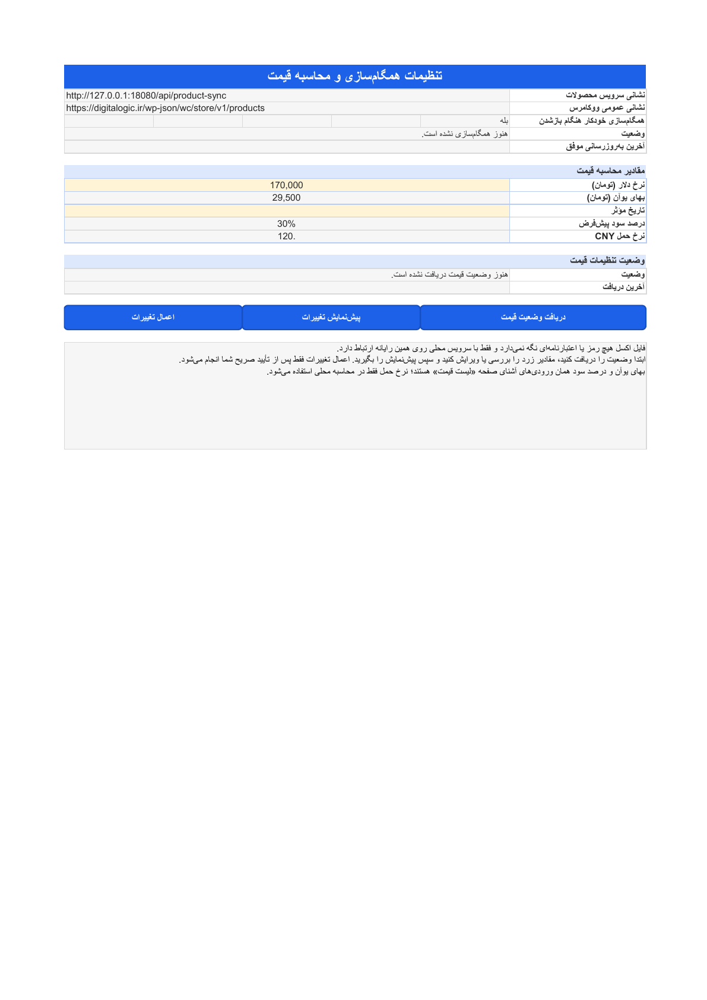

# Excel pricing-settings companion

Patris Export is the credential boundary between the canonical
`Digitalogic-Price-Calculator.xltm` workbook and Digitalogic's guarded
pricing-settings API. The workbook never contains a WordPress, WooCommerce, or
product-sync credential.

## Local loopback contract

All routes are `POST` and accept JSON only:

```text
/api/excel/pricing-sync/session
/api/excel/pricing-sync/state
/api/excel/pricing-sync/preview
/api/excel/pricing-sync/apply
```

The session route accepts `{}` and returns:

```json
{
  "schema": "patris.excel-pricing-companion-session/v1",
  "csrf_token": "opaque-43-character-value",
  "expires_at": "2026-07-26T18:10:00Z"
}
```

Every call sends `X-Patris-Excel-Client:
digitalogic-price-calculator/v1`. State, preview, and apply also send the
short-lived token in `X-Patris-Excel-CSRF-Token`. The token is stored only as a
SHA-256 hash in memory, expires after ten minutes, and is never a remote
credential.

The local surface accepts only a direct loopback peer and loopback request
host. Proxy-forwarding markers and cross-origin requests are rejected.
Same-origin browser requests must provide their exact origin. No CORS
allowance or `OPTIONS` route is emitted. Requests are bounded to 64 KiB and
responses to 4 MiB.

## Local request schema

State uses `patris.excel-pricing-companion-request/v1`:

```json
{
  "schema": "patris.excel-pricing-companion-request/v1",
  "schema_version": 1,
  "operation": "state",
  "page": 1,
  "limit": 100,
  "locale": "fa"
}
```

Preview submits one complete settings document. The `Idempotency-Key` header
must equal the body value and `If-Match` must contain the quoted body revision.

```json
{
  "schema": "patris.excel-pricing-companion-request/v1",
  "schema_version": 1,
  "operation": "preview",
  "idempotency_key": "excel-preview-20260726-0001",
  "expected_state_revision": "sha256:...",
  "settings": {
    "dollar_price": 170000,
    "yuan_price": 25300,
    "effective_date": "2026-07-26",
    "default_profit_percent": "30"
  },
  "product_changes": []
}
```

Apply repeats the exact settings and revision from preview and adds the bound
digest plus explicit confirmation:

```json
{
  "schema": "patris.excel-pricing-companion-request/v1",
  "schema_version": 1,
  "operation": "apply",
  "idempotency_key": "excel-apply-20260726-0001",
  "expected_state_revision": "sha256:...",
  "settings": {
    "dollar_price": 170000,
    "yuan_price": 25300,
    "effective_date": "2026-07-26",
    "default_profit_percent": "30"
  },
  "product_changes": [],
  "preview_digest": "sha256:...",
  "confirmation": "APPLY"
}
```

Product-level changes are deliberately unsupported on this global-settings
surface. State paging is limited to 100 rows. Rates, date, percentage,
revisions, idempotency, and confirmation are validated before network access.

## Protected remote boundary

The companion uses the existing `send_updates.url` only to derive the exact
same-origin WordPress routes:

```text
/wp-json/digitalogic/excel/pricing-sync/state
/wp-json/digitalogic/excel/pricing-sync/preview
/wp-json/digitalogic/excel/pricing-sync/apply
```

It reads the credential named by `send_updates.product_sync_secret_env` and
injects it as `X-Patris-Product-Sync-Secret`. It also materializes the current
canonical `patris.product-sync` contract and injects its exact
`{id,dataset,revision}`. The workbook cannot provide or override either value.

The destination must be HTTPS except for loopback development, may not contain
user information, a query, or a fragment, and must already be a WordPress REST
path. Redirects are not followed. Timeouts are bounded between one and thirty
seconds. Remote credentials, response bodies, target URLs, and transport errors
are not logged or copied into local errors.

Successful responses preserve Digitalogic's schemas:

- `digitalogic.excel-pricing-sync-state/v1`
- `digitalogic.excel-pricing-sync-preview/v1`
- `digitalogic.excel-pricing-sync-apply/v1`

After a successful apply, Patris invalidates its pricing-catalog cache,
regenerates the canonical product contract, synchronously sends that contract
through the existing protected product-sync delivery path, and refetches
pricing state with the new source revision. Apply succeeds locally only when
the product-sync receiver reports a terminal accepted/current/replayed/recovered
result with the exact event ID and zero pending or deferred products, and the
final state revision exactly matches Digitalogic's apply readback.

## Configuration

No new secret is introduced:

```toml
[send_updates]
enabled = true
url = "https://digitalogic.ir/wp-json/digitalogic/patris/product-sync"
method = "POST"
format = "json"
mode = "full"
require_contract = true
product_sync_secret_env = "PATRIS_PRODUCT_SYNC_SECRET"
timeout = "10s"
```

Set the named environment variable in the protected Patris runtime
environment. Never write its value into TOML/JSON/YAML, VBA, workbook cells,
URLs, logs, or command arguments.

## Workbook operator flow

On the Persian `تنظیمات` sheet:

1. Select **دریافت وضعیت قیمت**.
2. Review or edit the highlighted dollar rate and effective date. Yuan and
   default profit remain linked to their familiar calculator inputs.
3. Select **پیش‌نمایش تغییرات** and review the warning count.
4. Select **اعمال تغییرات** and approve the explicit Persian confirmation.

Changing any setting or refreshing state after preview invalidates the local
apply guard. The remote service independently enforces the exact revision,
idempotency key, preview digest, settings document, source identity, and
`APPLY` confirmation.


