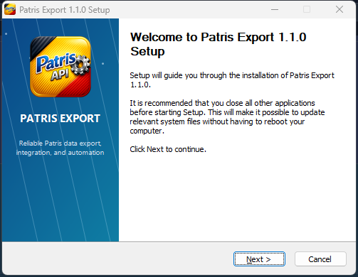

# Patris Export Windows installer

The assisted installer is the recommended Windows distribution for a normal
standalone Patris Export deployment. It installs the source-built executable,
the pxlib and MinGW runtime libraries, documentation, and (by default) the C
shared-library SDK. The portable ZIP remains available for embedding and
automation scenarios that should not register an installed application.



## Installation

1. Download `patris-export-vX.Y.Z-windows-amd64-setup.exe` and `SHA256SUMS`
   from the same GitHub release.
2. Verify the installer hash before running it.
3. Choose a current-user installation (the default) or an all-users
   installation, then select the optional SDK and desktop shortcut components.
4. Configure the database and server settings after installation. The bundled
   `config.example.toml` is a safe starting point; copy it to
   `%APPDATA%\Patris Export\patris-export.toml` and edit the copy.

The application also accepts an explicit repeated `--config` option. Existing
configuration is stored outside the application directory and is never
overwritten by installation or upgrade.

## Silent deployment

Use one of the install-mode switches. `/D=...` must be the last argument when
an explicit destination is supplied.

```powershell
& .\patris-export-vX.Y.Z-windows-amd64-setup.exe /S /CurrentUser
& .\patris-export-vX.Y.Z-windows-amd64-setup.exe /S /AllUsers
& .\patris-export-vX.Y.Z-windows-amd64-setup.exe /S /CurrentUser /D=C:\Tools\PatrisExport
```

Silent uninstall preserves configuration by default:

```powershell
& "$env:LOCALAPPDATA\Programs\Patris Export\Uninstall.exe" /S /CurrentUser
```

Pass `/PURGEDATA` only for a permanent removal. It deletes the current user's
Patris Export configuration, caches, and local license state; an all-users
uninstall also removes the machine-wide Patris Export data directory.

```powershell
& "$env:LOCALAPPDATA\Programs\Patris Export\Uninstall.exe" /S /CurrentUser /PURGEDATA
```

## Components and installed files

- The core component contains `patris-export.exe`, `libpxlib.dll`, the required
  MinGW runtime DLLs, the MIT license, third-party `NOTICE`, changelog, build
  manifest, installer guide, and licensing guide.
- The Developer Integration SDK contains `patris-export.dll` and
  `patris-export.h`. Deselect it only when the machine will use the standalone
  executable and local HTTP/IPC modes exclusively.
- Start-menu shortcuts are always installed. The desktop shortcut is optional.

The installer registers an uninstall entry and an App Paths entry for
`patris-export.exe`. It does not claim generic `.db`, `.csv`, or `.xlsx` file
associations and does not add broad directories to `PATH`.

When the source payload contains `BUILD-VARIANT.json`, the installer carries it
unchanged into the installed directory. Non-standard variants such as
`alm-compat` are also included in the setup filename, keeping standard and
license-enabled downloads unambiguous without changing internal executable or
DLL names.

For an `alm-compat` build, activation remains an explicit application action;
the installer never embeds or accepts an application identifier or license key
on its command line. After installation, use the documented CLI flow:

```powershell
patris-export.exe license status
patris-export.exe license challenge
patris-export.exe license install --file C:\Path\to\license.key
```

This validates the key before writing it to the per-user license store. See
`LICENSING.md` for key generation compatibility, storage, removal, ABI calls,
and security limitations. Standard builds expose the same status surface with
licensing disabled and require no activation.

## Building locally

Build or extract the complete Windows payload, then run:

```powershell
powershell.exe -NoProfile -ExecutionPolicy Bypass `
  -File .\scripts\windows\Build-Installer.ps1 `
  -PayloadDirectory C:\path\to\patris-export-windows-amd64 `
  -OutputDirectory .\build\installer
```

The build locates `makensis.exe` on `PATH`, through `MAKENSIS_PATH`, in a normal
NSIS installation, or in electron-builder's local NSIS cache. It generates the
branded 24-bit MUI2 artwork deterministically from the tracked Patris icon.

Release CI builds the installer from the same canonical Windows payload as the
portable ZIP, checks its SHA-256 digest, performs silent install and application
smoke tests, verifies normal-uninstall preservation, verifies `/PURGEDATA`, and
only then makes it available to the release publication job.

If repository secrets `WINDOWS_SIGNING_PFX_BASE64` and
`WINDOWS_SIGNING_PASSWORD` are configured, release CI Authenticode-signs the
installer with SHA-256, applies a trusted timestamp, and requires Windows to
report a valid signature before checksums are generated. Without a configured
certificate the workflow publishes an explicitly checksummed unsigned setup;
it never creates or embeds a private key.
